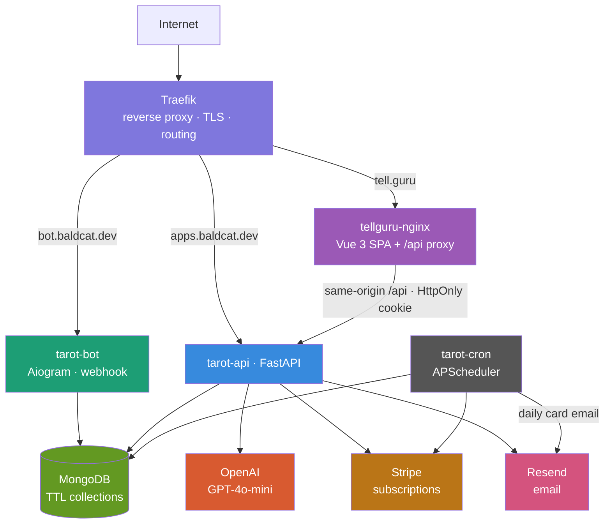
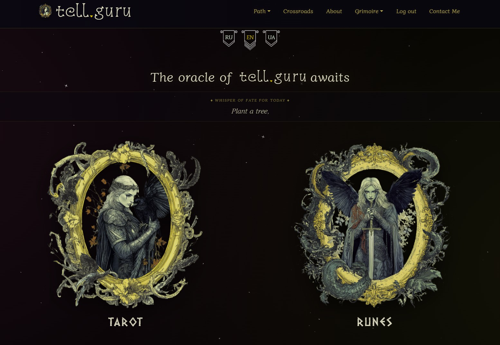
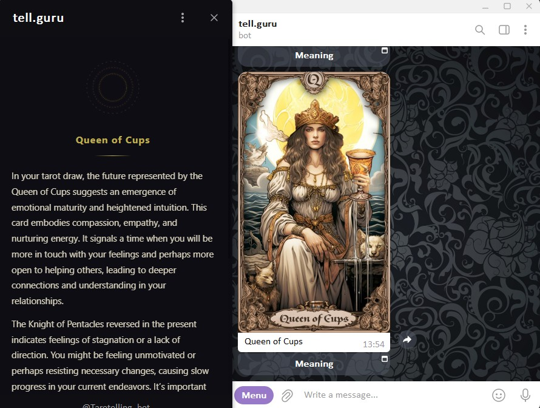
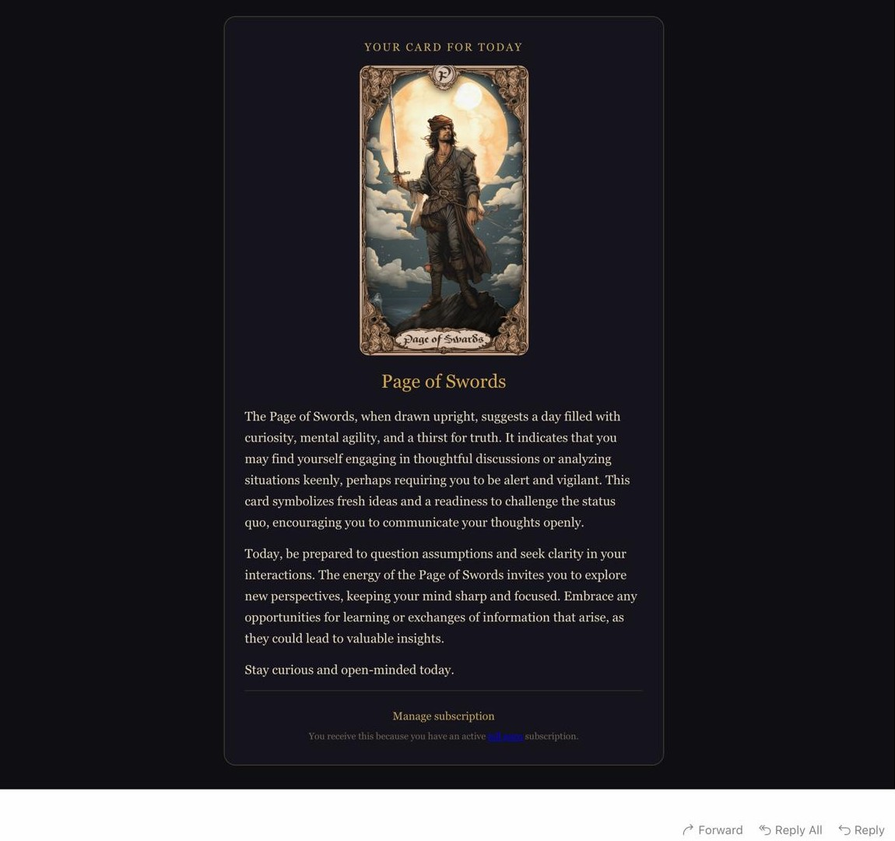

# 🔮 tell.guru — AI Tarot & Runes

> Live: **[tell.guru](https://tell.guru)** · 🤖 **[@Tarotelling_bot](https://t.me/Tarotelling_bot)** · 🐈‍⬛ a [Mnimi&Baldcat](https://baldcat.dev) product
>
> AI-powered tarot & rune readings across a Telegram bot and a Vue web app, sharing one FastAPI backend.

> ℹ️ **Portfolio showcase.** This repository presents the architecture and selected
> engineering of a live product. It is **source-available, not open-source** — see
> [LICENSE](./LICENSE). The full working code, prompts, tuning and infrastructure are private.

---

## What is this?

A distributed app that delivers AI-generated tarot and rune readings across two platforms — a
**Telegram bot** and a **Vue 3 web app** — backed by a single **FastAPI** service. Everything runs in
**Docker behind Traefik**, with **OpenAI** doing the interpretations, **Stripe** handling
subscriptions, and **Resend** sending a daily-card email to subscribers.

---

## Architecture



---

## Tech Stack

### Backend


### Frontend


### Bot


### Infrastructure


---

## Services

| Service | Domain | Description |
|---|---|---|
| `tarot-api` | `apps.baldcat.dev` | FastAPI backend — cards, auth, quota, Stripe, email |
| `tarot-bot` | `bot.baldcat.dev` | Telegram bot (webhook) |
| `tellguru-nginx` | `tell.guru` | Vue 3 SPA + same-origin `/api` reverse proxy |
| `tarot-cron` | — | APScheduler sidecar — daily card email to subscribers |
| `traefik` | — | Reverse proxy, TLS, routing |

---

## Engineering highlights

A few problems I found interesting to solve. Snippets below are **trimmed and sanitised** for
illustration — they are not the full implementation.

### 🔐 Passwordless auth + first-party HttpOnly session

Web auth is a single-use **magic link** (token hashed at rest, 15-min TTL, anti-enumeration). The
session is a **first-party HttpOnly + Secure cookie** issued over a **same-origin `/api` reverse
proxy**, so the token is never visible to JavaScript and there is no CORS surface.

```python
# Atomically consume a one-time link: matched only if unused and unexpired,
# flipped to used in the same write — no read-then-write race.
doc = magic_links.find_one_and_update(
    {"_id": _hash_token(token), "used": False, "expires_at": {"$gt": now}},
    {"$set": {"used": True, "used_at": now}},
)
if not doc:
    return {"success": False, "error": "Invalid or expired link"}

response.set_cookie(
    "session_id", session_id,
    max_age=7 * 24 * 3600,
    httponly=True, secure=True, samesite="lax", path="/",
)
```

### 🎟️ Race-safe daily quota (one Mongo write)

Each principal gets one quota doc. A single upsert with an aggregation pipeline resets the counter
when the day rolls over **or** increments it — atomic, so concurrent readings can't over-spend.
This is what protects the OpenAI bill from abuse.

```python
# Reset-or-increment in one atomic upsert. If `day` changed, start at 1;
# otherwise add 1. A unique index + DuplicateKeyError handles the first insert race.
doc = quota.find_one_and_update(
    {"_id": user_id},
    [{"$set": {
        "day": today,
        "count": {"$cond": [{"$eq": ["$day", today]}, {"$add": ["$count", 1]}, 1]},
    }}],
    upsert=True, return_document=AFTER,
)
allowed = doc["count"] <= daily_limit
```

### 🌐 Trustworthy client IP behind a proxy

Rate limits are only as good as the IP they key on. `X-Forwarded-For` is spoofable on the left, so
the real client is read from a **trusted hop count**, and IPv6 is collapsed to a `/64` so a single
user can't cycle addresses to dodge limits.

```python
def get_real_ip(request) -> str:
    xff = request.headers.get("x-forwarded-for", "")
    chain = [p.strip() for p in xff.split(",") if p.strip()]
    # Trust only the hop our own proxy appended (env-configurable); never the leftmost.
    ip = chain[-TRUSTED_PROXY_HOPS] if len(chain) >= TRUSTED_PROXY_HOPS else request.client.host
    return _to_ipv6_64(ip)  # IPv6 -> /64 network so it can't be rotated per-request
```

### Other things worth a mention

- **OpenAI budget cap** — a global daily call ceiling as a backstop behind the per-user quota.
- **Bot/web isolation** — internal-only endpoints are gated by a shared-secret header
  (`secrets.compare_digest`, fail-closed) so bot-only routes aren't reachable from the web.
- **Calendar-based daily card** — resets at local midnight, not 24h after last use.
- **Daily card email** — APScheduler sidecar draws one card, generates the reading in the
  subscriber's language, and emails it via Resend; idempotent per day, counts against the quota.
- **Language-keyed cache** — card meanings cached per language (Pinia + localStorage); switching
  language re-fetches the open reading instead of showing a stale one.
- **Honeypot spam protection** — the contact form silently drops bot submissions.

---

## Security

This started as a security review and the hardening became a feature in its own right:

- Rate limiting keyed on the **real** client IP (trusted-hop `X-Forwarded-For`, IPv6 `/64`).
- Per-user **daily quota** + global **OpenAI budget cap** to stop token-draining abuse.
- **Internal-key isolation** for bot-only endpoints (constant-time compare, fail-closed).
- Magic-link auth: hashed tokens, single-use, short TTL, send cooldown, no account enumeration.
- **HttpOnly + Secure** session cookie via a same-origin proxy (no token in JS, no CORS).
- Mongo with authentication; Docker `json-file` log rotation; least-privilege container networking.

---

## Screenshots

> _Save your images as `docs/web.jpg`, `docs/bot.jpg`, `docs/email.jpg` and they'll appear below._

| Web app | Telegram bot | Daily email |
|---|---|---|
|  |  |  |

---

## Related

- 🌐 [tell.guru](https://tell.guru) — web app
- 🤖 [@Tarotelling_bot](https://t.me/Tarotelling_bot) — Telegram bot
